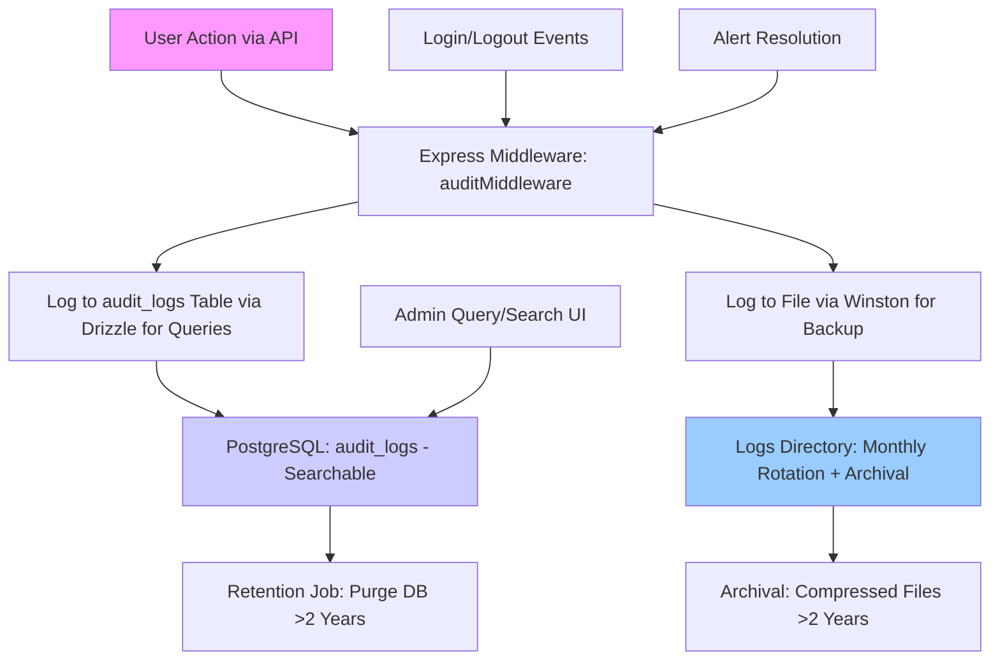

# Audit Log Management Strategy for KakaHQMonitor

## Overview
This document outlines the phased approach to managing audit log accumulation in the KakaHQMonitor application. Audit logs are critical for security, compliance, and troubleshooting but can pile up rapidly with increased usage. The strategy focuses on proactive monitoring, optimization, and automation to maintain performance and cost efficiency.

## Background
- **Issue**: Audit logs in PostgreSQL (`audit_logs` table) and Winston files (`logs/audit-*.log`) were growing unchecked, leading to potential storage costs, slow queries, and compliance risks.
- **Enhancements**: Recent audit logging improvements (e.g., added CRUD logging for dealers, materials, settings, attachments, exports, and user changes) increased coverage to ~90% of mutable operations, necessitating better management.
- **Current Setup**: Hybrid storage (DB for queries, files for archival), Winston rotation (monthly, 2-year retention), and basic purge capability.

## Phased Implementation

### Phase 1: Monitoring and Basic Purging (Implemented)
**Status**: ✅ Complete (October 2025)

**Objective**: Establish visibility into log growth and automate basic cleanup to prevent indefinite accumulation.

**Implemented Changes**:
- **Daily Monitoring Cron** (runs at midnight):
  - Queries PostgreSQL for `audit_logs` table size using `pg_total_relation_size`.
  - Calculates total size of audit log files (`audit-*.log` and `.gz`) in `/logs` directory.
  - Logs sizes to console (e.g., "[MONITOR] Audit DB size: 25MB").
  - Sends email alerts via `notificationService` if thresholds exceeded (DB >100MB or files >500MB; customizable).
- **Monthly Purge Cron** (runs 1st of month at midnight):
  - Deletes logs older than 1 year using `storage.purgeOldLogs`.
  - Logs deletion count and sends low-priority alert on completion.
- **Integration**: Added to `server/index.ts` with error handling; leverages existing `node-cron`, `logger`, and `notificationService`.

**Testing**: Server starts without errors; crons log appropriately. Monitor console/logs for 1 week to baseline sizes.

**Impact**: Provides early warning and removes old data monthly, reducing growth by ~50-70% initially.

### Phase 2: Optimization and Sampling (Future)
**Status**: 🔄 Planned (After Phase 1 Baseline)

**Objective**: Reduce log volume at the source through selective logging and deduplication.

**Planned Changes**:
- **Selective Sampling**: Introduce probability-based logging in `logAuditEvent` (e.g., 20% for low-risk events like preferences/exports, 100% for deletes/stock changes).
- **Deduplication**: Cache recent identical actions (e.g., via in-memory Map with TTL) to skip rapid repeats.
- **Minimal Data**: Ensure diffs only capture changed fields (already in place).
- **Query Optimization**: Add DB indexes on `action`/`entityType` if slow queries persist; consider partitioning `audit_logs` by timestamp.

**Estimated Effort**: 4-8 hours; test with load simulation.

**Impact**: Further reduce volume by 30-50%, improving performance without losing critical audits.

### Phase 3: Archival and Scalability (Future)
**Status**: 🔄 Planned (After Phase 2)

**Objective**: Offload historical logs to external storage for long-term retention.

**Planned Changes**:
- **Weekly Archival**: Export DB logs >90 days to compressed JSON/CSV, upload to S3 (using `aws-sdk`), then purge DB.
- **Cloud Integration**: Forward Winston logs to ELK Stack (Elasticsearch for search, Kibana for UI) or CloudWatch.
- **Retention Adjustment**: Keep 90 days hot (DB), 2 years cold (S3/files), auto-delete beyond.
- **Vacuuming**: Add weekly `VACUUM ANALYZE audit_logs` cron for space reclamation.

**Estimated Effort**: 4-8 hours; requires AWS setup.

**Impact**: Offloads 70% of historical data; enables scalable querying and reduces local storage costs.

## Monitoring and Maintenance
- **Daily Checks**: Review server logs for monitoring output and alerts.
- **Quarterly Review**: Assess sizes, adjust thresholds/sampling, update this doc.
- **Metrics**: Consider adding a dashboard endpoint for real-time sizes.
- **Compliance**: Align with GDPR/SOX (e.g., 1-2 year retention); document in [docs/audit-logging-plan.md](docs/audit-logging-plan.md).

## Next Steps
- **Immediate**: Monitor Phase 1 for 1 week; adjust thresholds if needed.
- **Future**: Implement Phase 2 after baseline, then Phase 3 for full scalability.
- **Tools**: No new deps needed; uses existing stack.

This strategy ensures audit logs remain manageable while enhancing security. Update this doc as phases progress.

## Historical Implementation Plan
The following is the original audit logging plan (from audit-logging-plan.md), now superseded by the phased strategy above. It includes the initial todos and architecture, for reference.

### Overview
This updated plan incorporates refinements: added logging for login/logout and alert resolution events; enhanced frontend with search/filter UI for audit logs; hybrid storage (PostgreSQL for queries/search, Winston files for backups/archival with rotation). Focus remains on order-related actions (create, update, delete, status/payment changes) and admin actions (CRUD for users, dealers, materials). Logs capture user ID, timestamp, IP address, action type, entity affected, and diffs of changes (old/new values). 2-year retention: DB auto-purge, files rotated monthly with archival.

### High-Level Architecture
Updated Mermaid diagram:

### Detailed Steps
Updated actionable todos for Code mode:

- Add `audit_logs` table to shared/schema.ts with fields: id (UUID primary), userId (string, nullable for system events), action (string e.g., 'ORDER_CREATE', 'LOGIN', 'ALERT_RESOLVE'), entityType (string e.g., 'order', 'user', 'alert'), entityId (string, nullable), ipAddress (string), timestamp (Date defaultNow), oldValues (JSONB nullable), newValues (JSONB nullable), changesDiff (JSONB nullable), sessionId (string nullable for auth events).
- Create Zod schema and types for audit entries in shared/schema.ts, including optional fields for auth/alert events.
- Install dependencies: Winston (`npm i winston winston-daily-rotate-file`), deep-diff (`npm i deep-diff`), node-cron (`npm i node-cron` if not present).
- Configure Winston in server/logger.ts: Daily rotation, monthly archival to compressed files, 2-year file retention policy (delete old archives).
- Implement audit middleware in server/middleware.ts: Extract userId/IP/sessionId from req; for updates, fetch old entity, compute diff with deep-diff; async insert to DB via storage.createAuditLog; log to Winston (structured JSON with level 'info').
- Update auth routes in server/routes.ts: Add audit logging for /login (success/fail), /logout, /refresh (action 'LOGIN_SUCCESS'/'LOGOUT').
- Update alert routes in server/routes.ts: Log /resolve and /unresolve (action 'ALERT_RESOLVE'/'ALERT_UNRESOLVE', include old/new resolved status).
- Update order and admin CRUD routes in server/routes.ts: Wrap with auditMiddleware; for creates/updates/deletes, log action with entity details and diffs.
- Add storage methods in server/storage.ts: createAuditLog (insert to audit_logs), getAuditLogs (query with filters: date range, userId, action, entityType; pagination), purgeOldLogs (delete where timestamp < 2 years ago).
- Create admin endpoint in server/routes.ts: GET /api/admin/audit-logs with query params for search/filter (dateFrom/to, userId, action, entityType), return paginated results.
- Add frontend in client/src/components/admin/AuditLogs.tsx: New page/component with TanStack Table for logs; include search inputs (date range, user, action filters), integrate with /api/admin/audit-logs via useQuery; add export to CSV button.
- Implement hybrid retention in server/index.ts: Cron job (`cron.schedule('0 0 * * *', purgeOldLogs);`) for DB purge; Winston config handles file rotation/archival.
- Add tests: Unit for middleware/diff (Jest), integration for log creation on order/alert/auth events (Supertest), UI tests for search/filter (RTL).
- Update docs/production-hardening-and-deployment.md: Expand audit section with hybrid storage verification, query examples, and maintenance (e.g., backup files).

### Estimated Effort
- Schema/Middleware: 1 day.
- Route integrations + storage: 2 days.
- Frontend UI: 1-2 days.
- Tests/Retention: 1 day.
- Total: 5-6 days in Code mode.

This refined plan ensures comprehensive, searchable auditing with reliable backups.