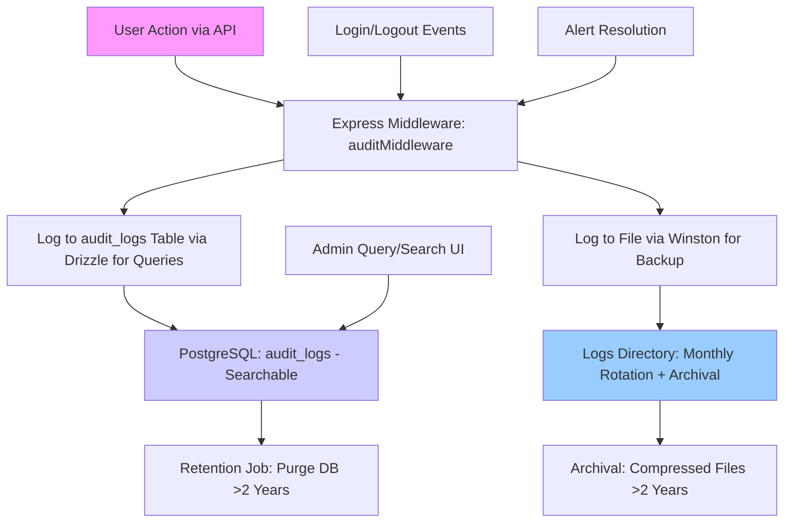

# Audit Logging System Implementation Plan (Updated)

## Overview
This updated plan incorporates refinements: added logging for login/logout and alert resolution events; enhanced frontend with search/filter UI for audit logs; hybrid storage (PostgreSQL for queries/search, Winston files for backups/archival with rotation). Focus remains on order-related actions (create, update, delete, status/payment changes) and admin actions (CRUD for users, dealers, materials). Logs capture user ID, timestamp, IP address, action type, entity affected, and diffs of changes (old/new values). 2-year retention: DB auto-purge, files rotated monthly with archival.

## High-Level Architecture
Updated Mermaid diagram:

## Detailed Steps
Updated actionable todos for Code mode:

- Add `audit_logs` table to shared/schema.ts with fields: id (UUID primary), userId (string, nullable for system events), action (string e.g., 'ORDER_CREATE', 'LOGIN', 'ALERT_RESOLVE'), entityType (string e.g., 'order', 'user', 'alert'), entityId (string, nullable), ipAddress (string), timestamp (Date defaultNow), oldValues (JSONB nullable), newValues (JSONB nullable), changesDiff (JSONB nullable), sessionId (string nullable for auth events).
- Create Zod schema and types for audit entries in shared/schema.ts, including optional fields for auth/alert events.
- Install dependencies: Winston (`npm i winston winston-daily-rotate-file`), deep-diff (`npm i deep-diff`), node-cron (`npm i node-cron` if not present).
- Configure Winston in server/logger.ts: Daily rotation, monthly archival to compressed files, 2-year file retention policy (delete old archives).
- Implement audit middleware in server/middleware.ts: Extract userId/IP/sessionId from req; for updates, fetch old entity, compute diff with deep-diff; async insert to DB via storage.createAuditLog; log to Winston (structured JSON with level 'info').
- Update auth routes in server/routes.ts: Add audit logging for /login (success/fail), /logout, /refresh (action 'LOGIN_SUCCESS'/'LOGOUT').
- Update alert routes in server/routes.ts: Log /resolve and /unresolve (action 'ALERT_RESOLVE'/'ALERT_UNRESOLVE', include old/new resolved status).
- Update order and admin CRUD routes in server/routes.ts: Wrap with auditMiddleware; for creates/updates/deletes, log action with entity details and diffs.
- Add storage methods in server/storage.ts: createAuditLog (insert to audit_logs), getAuditLogs (query with filters: date range, userId, action, entityType; pagination), purgeOldLogs (delete where timestamp < 2 years ago).
- Create admin endpoint in server/routes.ts: GET /api/admin/audit-logs with query params for search/filter (dateFrom/to, userId, action, entityType), return paginated results.
- Add frontend in client/src/components/admin/AuditLogs.tsx: New page/component with TanStack Table for logs; include search inputs (date range, user, action filters), integrate with /api/admin/audit-logs via useQuery; add export to CSV button.
- Implement hybrid retention in server/index.ts: Cron job (`cron.schedule('0 0 * * *', purgeOldLogs);`) for DB purge; Winston config handles file rotation/archival.
- Add tests: Unit for middleware/diff (Jest), integration for log creation on order/alert/auth events (Supertest), UI tests for search/filter (RTL).
- Update docs/production-hardening-and-deployment.md: Expand audit section with hybrid storage verification, query examples, and maintenance (e.g., backup files).

## Estimated Effort
- Schema/Middleware: 1 day.
- Route integrations + storage: 2 days.
- Frontend UI: 1-2 days.
- Tests/Retention: 1 day.
- Total: 5-6 days in Code mode.

This refined plan ensures comprehensive, searchable auditing with reliable backups.