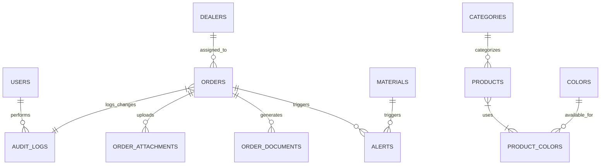

# Database Management Best Practices for KakaHQMonitor App

This Markdown document consolidates the analysis of your PostgreSQL database (as confirmed for your Ubuntu-based internal production server) and provides actionable best practices for managing growth, especially with text entries (e.g., order notes, contract details) and attachments (PDFs, DOCX generation per order). The schema is defined in [`shared/schema.ts`](shared/schema.ts) and connected via [`server/db.ts`](server/db.ts) using Drizzle ORM.

The database is well-suited for an order management system but risks bloat from base64-encoded files in `orderDocuments` and `orderAttachments` tables, plus accumulating `auditLogs`. These practices focus on prevention, optimization, and scalability for a self-hosted Ubuntu environment. Implement them iteratively to maintain performance without disrupting your running app (served via Node.js on the internal server).

## Database Schema Summary

Your PostgreSQL schema supports core workflows: user auth, dealer/order tracking, inventory, alerts, and document handling. Key tables:

- **Core Tables**:
  - `users`: Authentication and preferences (JSONB for refresh tokens).
  - `dealers`: Territory management (5 regions).
  - `orders`: Central entity with status/payment workflows, JSONB for items/contracts, decimal totals, and timestamps.
  - `materials`: Inventory with stock thresholds.
  - Lookup tables: `categories`, `products`, `colors`, `productColors`, `units`, `regions`, `productDetails`, `colorTypes` for order configuration.

- **Operational Tables**:
  - `alerts`: Linked notifications (unique constraints for duplicates).
  - `applicationSettings`: JSONB key-value config.
  - `auditLogs`: Action logging with JSONB diffs (high growth potential).

- **File Handling Tables** (Growth Hotspots):
  - `orderDocuments`: Generated PDFs (e.g., contracts; base64 `fileData`, default MIME "application/pdf").
  - `orderAttachments`: User uploads (PDFs, DOCX, images; base64 `fileData`, Zod-validated to 10MB and specific MIME types).

- **Security**: `revokedTokens` for JWT blacklisting.

**Relations Overview** (Drizzle-defined for integrity):

**Current Strengths**:
- Type-safe (Zod schemas, e.g., `insertOrderAttachmentSchema` limits file types/sizes).
- Auditable (timestamps, `auditLogs`).
- Flexible (JSONB for evolving data like contract items).

**Growth Risks**:
- Base64 files inflate DB size (e.g., 10MB PDF → ~13MB text).
- Text/JSONB fragmentation in notes/items.
- Indefinite `auditLogs` accumulation.
- No partitioning/indexes for large-scale queries.

**Environment Notes**: Production on Ubuntu internal server (PostgreSQL via `pg` pool). Use local tools (cron, `psql`) for management. Monitor via server dashboard (e.g., CPU/disk from screenshots).

## Best Practices

### 1. File Storage Optimization (Priority: High – Addresses PDF/DOCX/Attachment Bloat)
Base64 storage in DB is inefficient for binaries; offload to filesystem/cloud to reduce size by 90%+ and improve I/O.

- **Migrate to External Storage**:
  - Store files on Ubuntu filesystem (e.g., `/var/app/uploads/orders/`) or self-hosted MinIO (S3-compatible).
  - Update schema: Add `filePath` (text) and `fileHash` (varchar for integrity checks) to `orderAttachments` and `orderDocuments`. Remove `fileData` (migrate existing data first).
  - For DOCX generation (`server/docx-generator.ts`): Use `docx` library to create buffers, save via `fs.writeFileSync` to path, insert path in DB.
  - For PDFs (`server/pdf-generator.ts`, `server/pdf-preview-generator.ts`): Generate with `pdfkit` or similar, save/upload, store path.
  - Upload handling: In `server/routes.ts`, use `multer` for multipart forms; validate MIME/size with existing Zod.

- **Security/Access**:
  - Set permissions: `chown -R www-data:www-data /var/app/uploads/` (assuming Node runs as `www-data`).
  - Serve via Nginx (proxy from app): Add location block for `/uploads/` with auth if needed.
  - Retention: Auto-delete files for closed orders >1 year (cron script).

- **Compression**:
  - Compress PDFs/DOCX before storage (e.g., `pdf-lib` for PDFs).
  - Enable PostgreSQL TOAST for remaining text fields.

- **Ubuntu Implementation**:
  - Install MinIO if needed: `sudo apt update && wget https://dl.min.io/server/minio/release/linux-amd64/minio && chmod +x minio && sudo mv minio /usr/local/bin/`.
  - Run as service: `systemd` unit file for persistence.

### 2. Text Entries Efficiency (Priority: Medium – For Notes/JSONB)
Handle searchable/growing text without performance hits.

- **Indexing and Search**:
  - GIN indexes on JSONB: `CREATE INDEX CONCURRENTLY idx_orders_items ON orders USING GIN (items);`.
  - Full-text for notes: Add generated column `notes_tsv tsvector GENERATED ALWAYS AS (to_tsvector('english', COALESCE(notes, ''))) STORED;`, then `CREATE INDEX idx_orders_notes_fts ON orders USING GIN (notes_tsv);`.
  - Query example (in Drizzle): Use `sql` template for `@@ notes_tsv @@ plain $1`.

- **Normalization/Limits**:
  - Extract common JSONB fields (e.g., buyer name) to columns if usage patterns solidify.
  - Enforce limits: Update Zod (e.g., `notes: z.string().max(5000).optional()`).

- **Ubuntu Tools**:
  - Test indexes: `psql -d your_db -c "EXPLAIN ANALYZE SELECT * FROM orders WHERE notes ILIKE '%query%';"` (run during off-hours).

### 3. General Growth and Maintenance (Priority: High – Prevents Downtime)
Proactive measures for Ubuntu's manual management.

- **Archiving and Purging**:
  - Archive old orders: Extend `server/export-data.ts` to JSON; move to `/archives/` via cron: `0 3 * * 0 pg_dump -Fc your_db | gzip > /backups/db-$(date +%Y%m%d).dump.gz`.
  - Partition `auditLogs`: `CREATE TABLE audit_logs_2025_ytd PARTITION OF audit_logs FOR VALUES FROM ('2025-01-01') TO ('2026-01-01');` (use date-based).
  - Purge: Cron for expired data: `0 1 * * * psql -d your_db -c "DELETE FROM alerts WHERE resolved=true AND resolved_at < NOW() - INTERVAL '30 days'; DELETE FROM revoked_tokens WHERE expires_at < NOW(); VACUUM FULL;"`.

- **Monitoring and Alerts**:
  - Install tools: `sudo apt install prometheus grafana postgresql-contrib` (enable `pg_stat_statements` extension: `CREATE EXTENSION IF NOT EXISTS pg_stat_statements;`).
  - Metrics: Cron script to query size (`SELECT pg_size_pretty(pg_database_size('your_db'));`), insert into `alerts` if > threshold (e.g., 80% disk via `df`).
  - Dashboard: Grafana panels for table sizes, slow queries; alert on high `auditLogs` growth.

- **Backups and Recovery**:
  - Daily full + WAL: Edit `postgresql.conf` (`wal_level = replica; archive_mode = on; archive_command = 'test ! -f /wal_archives/%f && cp %p /wal_archives/%f'`).
  - Scripts: Enhance `server/scripts/backup.sh` with `pg_basebackup -D /backups/full -Ft -z -P`; test: `pg_restore -d test_restore backup.dump`.
  - Rotation: Use `logrotate` (`/etc/logrotate.d/postgres`).

- **Scaling and Performance**:
  - Vertical: Tune `postgresql.conf` (`shared_buffers = 256MB` or 25% RAM; `effective_cache_size = 75% RAM`; restart: `sudo systemctl restart postgresql`).
  - Horizontal: Streaming replication to secondary Ubuntu VM (primary: `wal_level=replica`; standby: `pg_basebackup` + recovery.conf).
  - Pooling: Use PgBouncer (`sudo apt install pgbouncer`); config in `/etc/pgbouncer/pgbouncer.ini`.
  - Queries: Paginate in app (e.g., Drizzle `limit`/`offset`); add indexes on filters (e.g., `CREATE INDEX idx_orders_status_created ON orders (status, created_at DESC);`).

- **Security**:
  - Firewall: `ufw allow from internal_ip to any port 5432`.
  - Roles: Use `postgres` superuser sparingly; create app role with least privileges.
  - Updates: `sudo apt update && sudo apt upgrade postgresql` regularly.

## Implementation Roadmap

Use this phased checklist for rollout. Test in dev (your local setup) before production.

### Phase 1: Assessment (1-2 Days)
- [ ] Query current DB size: `sudo -u postgres psql -d your_db -c "SELECT datname, pg_size_pretty(pg_database_size(datname)) FROM pg_database WHERE datname = 'your_db';"`
- [ ] List large tables: `SELECT schemaname, tablename, pg_size_pretty(pg_total_relation_size(schemaname||'.'||tablename)) FROM pg_tables WHERE schemaname='public' ORDER BY pg_total_relation_size(schemaname||'.'||tablename) DESC;`
- [ ] Check disk: `df -h /var/lib/postgresql/` (or your data dir).
- [ ] Backup current state: Run `server/scripts/backup.sh`.

### Phase 2: Quick Wins (3-5 Days)
- [ ] Migrate existing attachments to filesystem (script: Read base64, decode/save to path, update DB).
- [ ] Add basic indexes (e.g., on `orders.status`, `created_at`).
- [ ] Set up daily cron backups.
- [ ] Install monitoring (Prometheus/Grafana basics).

### Phase 3: Core Optimizations (1 Week)
- [ ] Schema changes: Alter tables for `filePath` (use Drizzle migrations: `npx drizzle-kit generate:pg`).
- [ ] Update code: Modify upload/generation routes to use filesystem/MinIO.
- [ ] Partition `auditLogs`; add full-text index on notes.
- [ ] Cron for purging.

### Phase 4: Advanced Scaling (Ongoing)
- [ ] Tune Postgres config; set up replication if traffic grows.
- [ ] Integrate DB alerts into app's `alerts` system.
- [ ] Monthly reviews: Analyze `pg_stat_statements` for slow queries; adjust as needed.

**Estimated Impact**: Halve DB size immediately via file migration; prevent 50%+ annual growth with archiving. Monitor post-implementation for 1 week.

For questions or refinements (e.g., specific scripts), refer back to this doc or provide metrics.