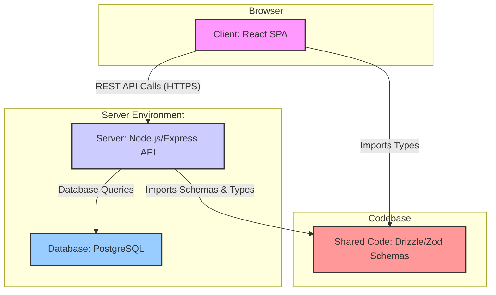

# Kaka HQ Monitoring Web App - Project Overview

## Project Overview

This is a full-stack monorepo application designed as an internal tool for the "Kaka" headquarters team. Its primary purpose is to monitor and manage orders received from five main dealers across different territories (Shenzhen, Guangzhou, Foshan, Hangzhou, Chengdu). The application provides a central dashboard for real-time visibility into orders, production, inventory, and dealer performance.

The application implements a comprehensive order management system with role-based access control, real-time alerts, and inventory tracking.

## Key Features

### Dashboard & Monitoring
- **Real-time Metrics**: Total revenue, order counts, average lead times, active dealers
- **Dealer Performance Tracking**: Revenue, order volume, on-time delivery rates per dealer
- **Inventory Overview**: Current stock levels, low-stock alerts, threshold monitoring
- **Alert System**: Priority-based notifications for delays, low stock, and critical issues

### Order Management
- **Order Lifecycle Tracking**: Received → Sent to Factory → In Production → Delivered
- **Dealer Assignment**: Orders linked to specific territories and dealers
- **Production Monitoring**: Lead time tracking, estimated vs actual delivery dates
- **Order History**: Complete audit trail with notes and status updates

### Inventory Control
- **Material Categories**: Railings, Lighting, Flooring, Privacy, Hardware
- **Stock Management**: Current/max stock levels, automatic low-stock alerts
- **Threshold Alerts**: Configurable warning levels for reordering

### User Management & Security
- **Role-based Access**: Admin and Standard user roles
- **JWT Authentication**: Secure login with refresh tokens
- **Admin Panel**: Full CRUD operations for users, dealers, orders, materials, alerts

### Data Entities
- **Users**: HQ team members with admin/standard roles
- **Dealers**: 5 territorial dealers with contact information
- **Orders**: Detailed order records with status, items, values, timelines
- **Materials**: Inventory items with stock levels and thresholds
- **Alerts**: Notification system with priority levels and resolution tracking

## High-Level Architecture

The application is structured as a monorepo with three main parts: a `client` (frontend), a `server` (backend), and a `shared` directory for common code, ensuring type safety and consistency across the stack.

Here is a diagram illustrating the overall architecture:

## Backend (`server/`)

The backend is a robust Node.js application built with Express and TypeScript. It follows a standard layered architecture.

### Technology Stack:
- **Framework:** Express.js
- **Language:** TypeScript
- **ORM:** Drizzle for type-safe SQL database interactions.
- **Authentication:** Custom JWT implementation with refresh token rotation for enhanced security.

### Structure & Key Files:
- `index.ts`: The application's entry point, responsible for setting up the Express server, middleware, and Vite integration for development.
- `routes.ts`: Comprehensive API endpoints covering authentication, dashboard metrics, dealer management, order lifecycle, inventory control, and admin operations.
- `storage.ts`: Data access layer with full CRUD operations for all entities (users, dealers, orders, materials, alerts) using Drizzle ORM.
- `auth.ts` & `middleware.ts`: Custom JWT-based authentication, including token generation, refresh token rotation, and role-based access control middleware.
- `db.ts`: Database connection setup using PostgreSQL with Drizzle ORM.
- `seed.ts`: Database seeding script that populates initial data including admin user, dealers, sample orders, materials, and alerts.

## Frontend (`client/`)

The frontend is a modern single-page application (SPA) built with React.

### Technology Stack:
- **Framework:** React
- **Build Tool:** Vite for a fast development experience.
- **Language:** TypeScript (TSX)
- **Styling:** Tailwind CSS for a utility-first styling approach.
- **UI Components:** A comprehensive set of UI components from shadcn/ui (indicated by the use of @radix-ui primitives and the file structure in `client/src/components/ui`).
- **State Management:** TanStack Query (React Query) is used for managing server state (fetching, caching, and updating data), while React Context is likely used for global UI state like theming.
- **Routing:** Wouter provides a minimalist routing solution.
- **Data Visualization:** Recharts is used for rendering charts on the dashboard.

### Structure & Key Directories:
- `pages/`: Top-level page components including `dashboard.tsx`, `login.tsx`, `admin.tsx`, `profile.tsx`, and `not-found.tsx`.
- `components/`: Reusable UI components including dashboard widgets (`MetricCard`, `DealerPerformanceChart`, `AlertsPanel`), data tables (`RecentOrdersTable`), and shadcn/ui component library.
- `hooks/`: Custom hooks like `use-dashboard.ts` for data fetching and state management.
- `lib/`: Utility functions, TanStack Query client setup, and authentication context (`auth.tsx`).
- `components/ui/`: Complete shadcn/ui component library with 40+ accessible components.

## Shared Code (`shared/`)

This directory is crucial for maintaining consistency and type safety between the frontend and backend.

- `schema.ts`: The single source of truth for the application's data model, defining:
  - **Database Tables**: Users (HQ staff), Dealers (territories), Orders (with lifecycle), Materials (inventory), Alerts (notifications)
  - **Relationships**: Foreign keys and joins between entities
  - **Zod Schemas**: Runtime validation and TypeScript type generation for all data structures
  - **Type Exports**: Shared types used across frontend and backend for type safety

## Conclusion

The Kaka HQ Monitoring Web App is a well-architected, modern full-stack application. The use of TypeScript, Drizzle, and Zod provides a strong foundation of type safety from the database all the way to the UI. The codebase is organized logically, with a clear separation of concerns that should make it relatively straightforward to understand and modify.

You are now in a good position to start making modifications. I recommend exploring the `routes.ts` file on the server and the corresponding page components on the client to trace the flow of data for a specific feature.