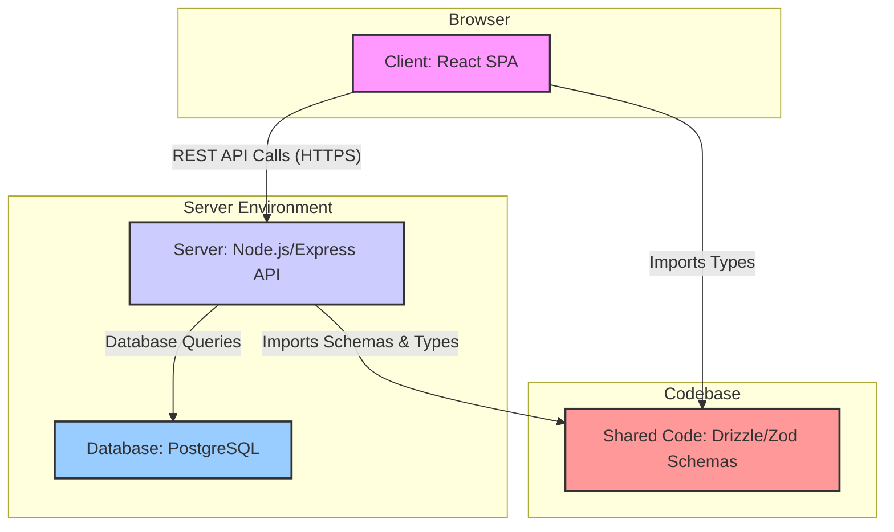

# Kaka HQ Monitoring Web App - Project Overview

## Project Overview

This is a full-stack monorepo application designed as an internal tool for the "Kaka" headquarters team. Its primary purpose is to monitor and manage orders received from five main dealers across different territories (Shenzhen, Guangzhou, Foshan, Hangzhou, Chengdu). The application provides a central dashboard for real-time visibility into orders, production, inventory, and dealer performance.

The application implements a comprehensive order management system with role-based access control, real-time alerts, and inventory tracking.

## Key Features

### Dashboard & Monitoring
- **Real-time Metrics**: Total revenue, order counts, average lead times, active dealers
- **Dealer Performance Tracking**: Revenue, order volume, on-time delivery rates per dealer
- **Inventory Overview**: Current stock levels, low-stock alerts, threshold monitoring
- **Alert System**: Priority-based notifications for delays, low stock, and critical issues

### Order Management
- **Order Lifecycle Tracking**: Received → Sent to Factory → In Production → Delivered
- **Dealer Assignment**: Orders linked to specific territories and dealers
- **Production Monitoring**: Lead time tracking, estimated vs actual delivery dates
- **Order History**: Complete audit trail with notes and status updates

### Inventory Control
- **Material Categories**: Railings, Lighting, Flooring, Privacy, Hardware
- **Stock Management**: Current/max stock levels, automatic low-stock alerts
- **Threshold Alerts**: Configurable warning levels for reordering

### User Management & Security
- **Role-based Access**: Admin and Standard user roles
- **JWT Authentication**: Secure login with refresh tokens
- **Admin Panel**: Full CRUD operations for users, dealers, orders, materials, alerts

### Data Entities
- **Users**: HQ team members with admin/standard roles
- **Dealers**: 5 territorial dealers with contact information
- **Orders**: Detailed order records with status, items, values, timelines
- **Materials**: Inventory items with stock levels and thresholds
- **Alerts**: Notification system with priority levels and resolution tracking

## High-Level Architecture

The application is structured as a monorepo with three main parts: a `client` (frontend), a `server` (backend), and a `shared` directory for common code, ensuring type safety and consistency across the stack.

Here is a diagram illustrating the overall architecture:



## Backend (`server/`)

The backend is a robust Node.js application built with Express and TypeScript. It follows a standard layered architecture.

### Technology Stack:
- **Framework:** Express.js
- **Language:** TypeScript
- **ORM:** Drizzle for type-safe SQL database interactions.
- **Authentication:** Custom JWT implementation with refresh token rotation for enhanced security.

### Structure & Key Files:
- `index.ts`: The application's entry point, responsible for setting up the Express server, middleware, and Vite integration for development.
- `routes.ts`: Comprehensive API endpoints covering authentication, dashboard metrics, dealer management, order lifecycle, inventory control, and admin operations.
- `storage.ts`: Data access layer with full CRUD operations for all entities (users, dealers, orders, materials, alerts) using Drizzle ORM.
- `auth.ts` & `middleware.ts`: Custom JWT-based authentication, including token generation, refresh token rotation, and role-based access control middleware.
- `db.ts`: Database connection setup using PostgreSQL with Drizzle ORM.
- `seed.ts`: Database seeding script that populates initial data including admin user, dealers, sample orders, materials, and alerts.

## Frontend (`client/`)

The frontend is a modern single-page application (SPA) built with React.

### Technology Stack:
- **Framework:** React
- **Build Tool:** Vite for a fast development experience.
- **Language:** TypeScript (TSX)
- **Styling:** Tailwind CSS for a utility-first styling approach.
- **UI Components:** A comprehensive set of UI components from shadcn/ui (indicated by the use of @radix-ui primitives and the file structure in `client/src/components/ui`).
- **State Management:** TanStack Query (React Query) is used for managing server state (fetching, caching, and updating data), while React Context is likely used for global UI state like theming.
- **Routing:** Wouter provides a minimalist routing solution.
- **Data Visualization:** Recharts is used for rendering charts on the dashboard.

### Structure & Key Directories:
- `pages/`: Top-level page components including `dashboard.tsx`, `login.tsx`, `admin.tsx`, `profile.tsx`, and `not-found.tsx`.
- `components/`: Reusable UI components including dashboard widgets (`MetricCard`, `DealerPerformanceChart`, `AlertsPanel`), data tables (`RecentOrdersTable`), and shadcn/ui component library.
- `hooks/`: Custom hooks like `use-dashboard.ts` for data fetching and state management.
- `lib/`: Utility functions, TanStack Query client setup, and authentication context (`auth.tsx`).
- `components/ui/`: Complete shadcn/ui component library with 40+ accessible components.

## Shared Code (`shared/`)

This directory is crucial for maintaining consistency and type safety between the frontend and backend.

- `schema.ts`: The single source of truth for the application's data model, defining:
  - **Database Tables**: Users (HQ staff), Dealers (territories), Orders (with lifecycle), Materials (inventory), Alerts (notifications)
  - **Relationships**: Foreign keys and joins between entities
  - **Zod Schemas**: Runtime validation and TypeScript type generation for all data structures
  - **Type Exports**: Shared types used across frontend and backend for type safety

## Conclusion

The Kaka HQ Monitoring Web App is a well-architected, modern full-stack application. The use of TypeScript, Drizzle, and Zod provides a strong foundation of type safety from the database all the way to the UI. The codebase is organized logically, with a clear separation of concerns that should make it relatively straightforward to understand and modify.

You are now in a good position to start making modifications. I recommend exploring the `routes.ts` file on the server and the corresponding page components on the client to trace the flow of data for a specific feature.

## Current State Review

Date: October 29, 2025

This section provides a comprehensive review of the current state of the Kaka HQ Monitoring Web App based on an analysis of the codebase, documentation, configuration files, and dependencies. The review covers architecture, features, implementation status, discrepancies from original requirements, strengths, potential issues, and recommendations for future development.

### Current Implementation Status
- **Core Functionality**: Largely implemented with a focus on order management, dashboard metrics, alerts, and admin panels.
- **Deployment Readiness**: Suitable for development; production deployment would require environment-specific configurations (e.g., secure secrets, scaling).
- **Internationalization**: Basic support for English (en) and Chinese (zh) via i18next.
- **Theming**: Supports light/dark/system modes using next-themes.

The app deviates from the original requirements document (docs/ProjectRequirements.md), which specified Python/FastAPI and MongoDB. The actual stack uses Node.js/Express and PostgreSQL, indicating a pivot to a JavaScript/TypeScript monorepo for consistency.

### Architecture
#### High-Level Structure
The project is a monorepo with three main directories:
- **client/**: React frontend (SPA) built with Vite.
- **server/**: Node.js/Express backend API.
- **shared/**: Common schemas and types using Drizzle ORM and Zod for type safety.

#### Data Flow
- Frontend communicates with backend via RESTful API endpoints (HTTPS).
- Backend uses Drizzle ORM for PostgreSQL interactions (via Neon serverless driver).
- Shared types ensure end-to-end type safety.

Updated Mermaid diagram reflecting current state:
```mermaid
graph TD
    subgraph "Browser"
        A[Client: React SPA]
    end

    subgraph "Server Environment"
        B[Server: Node.js/Express API]
        C[Database: PostgreSQL (Neon)]
    end

    subgraph "Codebase"
        D[Shared: Drizzle/Zod Schemas]
    end

    A -- "REST API Calls (HTTPS)" --> B
    B -- "Drizzle ORM Queries" --> C
    B -- "Imports Schemas & Types" --> D
    A -- "Imports Types" --> D

    style A fill:#f9f,stroke:#333,stroke-width:2px
    style B fill:#ccf,stroke:#333,stroke-width:2px
    style C fill:#9cf,stroke:#333,stroke-width:2px
    style D fill:#f99,stroke:#333,stroke-width:2px
```

### Implemented Features
#### Authentication & Security
- JWT with access/refresh tokens; revocation blacklist.
- Roles: admin (full CRUD), standard (view/update own data).
- Endpoints: /api/auth/login, /refresh, /logout; user profile updates.

#### Dashboard & Monitoring
- Overview: Metrics (orders, revenue, lead times) via /api/dashboard/overview.
- Dealer Performance: /api/dealers with charts (Recharts).
- Inventory: Stock levels, low-stock alerts (/api/materials).
- Alerts: Real-time panel (/api/alerts); auto-checks for overdue payments, stuck orders, low stock.

#### Order Management
- CRUD: List (/api/orders), create (/api/orders), update status/payment (/api/orders/:id/status), details (/api/orders/:id).
- Lifecycle: received → sentToFactory → inProduction → delivered.
- Attachments: Upload/download/delete (/api/orders/:id/attachments).
- Document Generation: Contract PDFs/DOCX previews (/api/orders/:id/pdf-preview, /api/orders/preview).
- Exports: CSV/PDF for orders (/api/export-orders).

#### Admin Panel
- Full CRUD for: users, dealers, orders, materials, alerts, categories, products, colors, regions, productDetails, colorTypes, units.
- Reordering: Drag-and-drop sort for lists (e.g., /api/admin/categories/reorder).
- Alert Management: Manual checks/resolutions (/api/admin/check-*).

#### Inventory & Products
- Materials: Stock updates, thresholds (/api/materials/:id/stock).
- Product Catalog: Hierarchical (categories → products → colors/units/details/types/regions) for order forms.

#### Other
- Profile: Theme/language preferences (/api/user/preferences).
- Application Settings: Configurable via admin (/api/admin/application-settings).

### Discrepancies from Original Requirements
The original spec was conceptual and has been significantly evolved:
- **Stack Mismatch**:
  - Original: Python/FastAPI, MongoDB.
  - Current: Node.js/Express, PostgreSQL (Neon) – Better for JS monorepo, type safety.
- **Database**: NoSQL → Relational; Schemas now include product hierarchy not in original.
- **Auth**: Matches (JWT with refresh), but implemented with revocation table.
- **Frontend**: React + React Query (as suggested); Added shadcn/ui, Tailwind, i18n.
- **Features Added Beyond Spec**:
  - Product management (categories, colors, etc.) for detailed order forms.
  - Document generation (PDF/DOCX contracts).
  - File attachments for orders.
  - Admin reordering (drag-and-drop).
- **Missing/Partial**:
  - No WebSockets for live updates (alerts are polled).
  - Reporting: Basic exports; No advanced analytics (e.g., AI).
  - Mobile: Responsive but no PWA/native app.
  - Testing: No visible tests (recommend adding Jest/Cypress).

### Strengths
- **Type Safety**: End-to-end with TypeScript, Drizzle, Zod.
- **Modularity**: Clean separation (client/server/shared); shadcn/ui for reusable UI.
- **Security**: Comprehensive (JWT rotation, CSRF, rate limits).
- **Extensibility**: Product schema supports complex orders; Alert system is flexible.
- **Performance**: Vite for fast builds; TanStack Query for efficient data handling.

### Potential Issues & Risks
- **Scalability**: Single Express server; For high traffic, consider clustering or migration to NestJS.
- **Error Handling**: Basic in routes; Add global error middleware and logging (e.g., Winston).
- **Validation**: Zod used, but ensure all inputs are sanitized.
- **Dependencies**: Some outdated (e.g., express-session optional); Run `npm audit`.
- **Database**: Neon serverless is fine for dev; Monitor costs for prod.
- **i18n**: Basic; Expand translations for admin panels.
- **Accessibility**: shadcn/ui is ARIA-compliant, but test full app (WCAG).
- **No Tests**: High risk; Implement unit/integration tests.
- **Secrets**: Ensure .env is gitignored; never commit. For LAN, store in secure vault or encrypted file.

### Recommendations
- **Immediate**:
  - Update ProjectRequirements.md to match current stack.
  - Add tests: Jest for backend, React Testing Library for frontend.
  - Implement logging (e.g., Pino) and monitoring (e.g., Sentry).
- **Short-Term**:
  - Add WebSockets (Socket.io) for real-time alerts.
  - Enhance reporting: Advanced filters, scheduled exports.
  - Optimize images/fonts in server/ (e.g., compress logos).
- **Long-Term**:
  - Migrate to microservices if scaling needed.
  - Add CI/CD: GitHub Actions for build/test/deploy.
  - Performance: Add caching (Redis) for dashboard queries.
  - Security Audit: Penetration testing for auth flows.

This review confirms the app is in a mature state for internal use, with strong foundations for expansion. Total lines analyzed: ~10k+ across files.

## Original Requirements

The following is the original project requirements document (from ProjectRequirements.md), for historical reference. The app has evolved significantly from this conceptual blueprint.

### Project Overview
#### Description
This web-based tool is designed for the headquarters (HQ) team of Kaka, a business specializing in selling balcony and garden upgrades. The HQ team receives orders from 5 main dealers located in Shenzhen, Guangzhou, Foshan, Hangzhou, and Chengdu. Each dealer is responsible for their respective city/territory.

The tool facilitates order management by allowing the HQ team to:
- Receive and process orders from dealers.
- Send orders to the factory.
- Monitor materials, production lead times, and delivery to dealers.

The primary landing page is a Dashboard providing an overall business view and dealer-specific performance metrics. Additional features will enhance monitoring, alerting, and reporting to help the HQ team manage operations efficiently.

#### Objectives
- Provide real-time visibility into orders, production, and deliveries.
- Enable proactive issue resolution through alerts and analytics.
- Ensure secure access for HQ team members only.
- Support scalability for potential addition of more dealers or features.

#### Scope
- In-Scope: Dashboard, order tracking, dealer performance views, alerts, inventory monitoring, basic reporting.
- Out-of-Scope: Dealer-facing interfaces, factory integration (assume API hooks), payment processing, advanced AI analytics (can be added later).

#### Assumptions
- Users are HQ team members (adults in a professional setting).
- Data sources: Orders from dealers (via API or manual entry), factory updates (manual or integrated), material/inventory data.
- Deployment: Cloud-based (e.g., AWS, Vercel for frontend, Heroku/DigitalOcean for backend).

### Functional Requirements
#### User Roles
- **Admin User**: Full access to all features, including user management.
- **Standard HQ User**: Access to dashboard, order monitoring, alerts, and reports.

#### Core Features
##### Authentication and Authorization
- Email-based authentication using JWT (JSON Web Tokens).
- Robust token system:
  - Access Token: Short-lived (e.g., 15-30 minutes expiration).
  - Refresh Token: Longer-lived (e.g., 7 days), stored securely (e.g., HTTP-only cookie).
  - Auto Token Refresh: Implement logic to automatically refresh the access token before it expires using the refresh token (handled via React Query interceptors).
  - Auto Cleanup: Revoke and clean up expired or used tokens on the server-side (e.g., blacklist in MongoDB or use short TTLs).
- Features: Signup (email verification), Login, Logout, Password Reset.
- Security: Protect against common vulnerabilities (e.g., XSS, CSRF).

##### Dashboard Page
- **Overall Business View**:
  - Total orders summary (new, in-process, completed).
  - Revenue metrics (YTD, monthly targets vs. actuals, average order value).
  - Lead time averages (production and delivery).
- **Dealer Performance**:
  - Per-dealer metrics (order volume, revenue, on-time delivery rate).
  - Comparison charts (bar/pie for dealers).
- **Visualizations**:
  - Trend lines (order inflows, delays).
  - Heat map or color-coded list for territories.
- **Alerts and Notifications**:
  - Real-time panel for critical alerts (e.g., low stock, delays).
  - Pending actions list.
- **Inventory Monitoring**:
  - Material stock overview with thresholds.
  - Supply chain timeline (Gantt-style for productions).
- **Interactive Elements**:
  - Drill-down links to detailed views.
  - Search and filters (by date, status, dealer).
  - Customizable views (pin KPIs).
- **Reporting**:
  - Quick export (PDF/CSV) for summaries.
  - Historical data access.

##### Order Management
- Create/View/Update Orders: From dealers to factory.
- Track Status: Received, Sent to Factory, In Production, Delivered.
- Material Allocation: Assign and monitor materials per order.
- Lead Time Tracking: Calculate and flag deviations.

##### Dealer Details Pages
- Linked from dashboard: Order history, metrics, contact info for each dealer (Shenzhen, Guangzhou, Foshan, Hangzhou, Chengdu).

##### Additional Pages
- User Profile: Update email/password.
- Admin Panel: Manage users, dealers.

### Non-Functional Requirements
- **Performance**: Load times < 2 seconds; handle up to 100 concurrent users.
- **Scalability**: Design for adding more dealers (e.g., dynamic MongoDB collections).
- **Security**: HTTPS, data encryption at rest/transit, input validation.
- **Accessibility**: WCAG 2.1 compliance (basic).
- **Reliability**: 99% uptime; error handling with logging.
- **Mobile Responsiveness**: Fully responsive design.

### Technical Stack
#### Backend
- **Framework**: FastAPI (for API development).
- **Language**: Python with Pydantic (for data models and validation).
- **Database**: MongoDB (NoSQL for flexible schemas, e.g., orders as documents).
- **Authentication**: JWT with libraries like PyJWT; refresh token logic in FastAPI middleware.
- **Other**: Async support for real-time features; WebSockets if needed for live updates.

#### Frontend
- **Framework**: React (with Create React App or Vite).
- **State Management**:
  - React Query: For backend data fetching, caching, and mutations (e.g., orders, alerts).
  - React Context: For frontend/UI state (e.g., theme, user preferences).
- **UI Library**: Optional - Material-UI or Tailwind CSS for components.
- **Routing**: React Router.
- **Other**: Axios or built-in fetch for API calls (integrated with React Query).

#### Architecture
- **Monolithic vs. Microservices**: Start with monolithic for simplicity; separate frontend/backend.
- **API Design**: RESTful endpoints; use OpenAPI/Swagger for documentation.
- **Data Flow**: Frontend fetches data via API; backend handles business logic and DB interactions.
- **Deployment**:
  - Frontend: Vercel/Netlify.
  - Backend: Heroku/DigitalOcean/AWS.
  - Database: MongoDB Atlas.

### Database Schema (MongoDB Collections)
#### Users
- _id: ObjectId
- email: String (unique)
- password: String (hashed)
- role: String (admin/standard)
- refreshTokens: Array of {token: String, expires: Date} (for cleanup)

#### Dealers
- _id: ObjectId
- name: String (e.g., "Shenzhen")
- territory: String
- contact: Object {email, phone}

#### Orders
- _id: ObjectId
- dealerId: ObjectId (ref to Dealers)
- status: String (received, sentToFactory, inProduction, delivered)
- materials: Array of {item: String, quantity: Number}
- productionLeadTime: Number (days)
- deliveryETA: Date
- createdAt: Date
- updatedAt: Date

#### Materials
- _id: ObjectId
- name: String
- stock: Number
- threshold: Number (low stock alert)

#### Alerts
- _id: ObjectId
- type: String (e.g., lowStock, delay)
- message: String
- priority: String (high/medium/low)
- resolved: Boolean

### API Endpoints (High-Level)
#### Auth
- POST /auth/signup: Create user.
- POST /auth/login: Generate access/refresh tokens.
- POST /auth/refresh: Refresh access token.
- POST /auth/logout: Invalidate tokens.

#### Dashboard
- GET /dashboard/overview: Fetch KPIs, metrics.
- GET /dashboard/dealers: Dealer performance data.
- GET /dashboard/alerts: List alerts.

#### Orders
- GET /orders: List all (filtered).
- POST /orders: Create new.
- PUT /orders/{id}: Update status/materials.
- GET /orders/{id}: Details.

#### Materials
- GET /materials: Inventory overview.
- PUT /materials/{id}: Update stock.

### Frontend Components
- **App.js**: Root with routing and context providers.
- **Dashboard.js**: Main page with charts (e.g., Recharts library), widgets.
- **Auth Components**: LoginForm, SignupForm.
- **OrderList.js**: Table with filtering (e.g., React Table).
- **DealerDetail.js**: Per-dealer views.

Use React Query for queries/mutations (e.g., useQuery for dashboard data, useMutation for order updates).

### Development Guidelines
- **Version Control**: Git (e.g., GitHub).
- **Testing**: Unit (Jest for frontend, Pytest for backend), Integration, E2E (Cypress).
- **CI/CD**: GitHub Actions.
- **Code Style**: ESLint/Prettier for frontend; Black for Python.
- **Documentation**: Inline comments; separate README.md.

### Timeline and Milestones (Estimated)
- Week 1-2: Setup (backend API, DB schema, auth).
- Week 3-4: Core features (order management, dashboard backend).
- Week 5-6: Frontend implementation (dashboard, components).
- Week 7: Testing, refinements.
- Week 8: Deployment and handover.

### Risks and Mitigations
- Risk: Token security issues. Mitigation: Use secure storage, regular audits.
- Risk: Data inconsistencies. Mitigation: Pydantic validation, React Query caching.
- Risk: Scalability with MongoDB. Mitigation: Indexing, sharding if needed.

This document served as a blueprint. Adjustments were made based on further discussions.